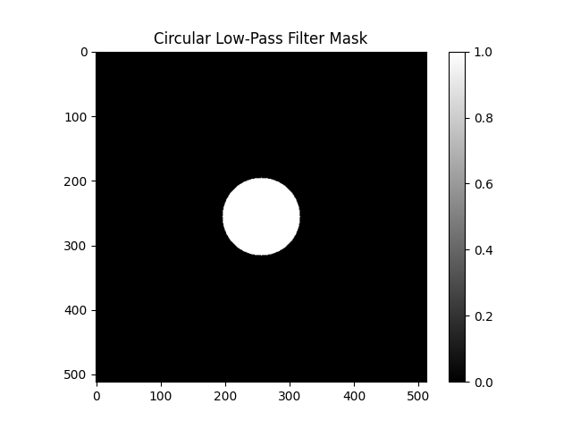
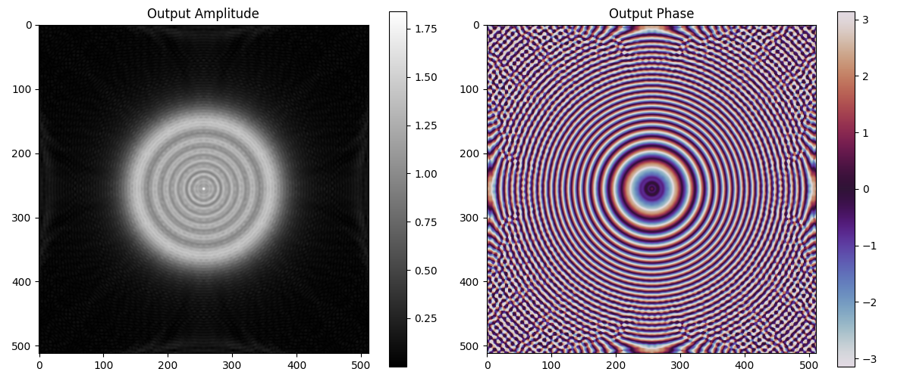

# 🔬 Fourier Optics Simulation

A simple Python simulation to demonstrate the fundamentals of Fourier optics and spatial filtering.

---

## 📁 Files

- fourier.py – Python script for Fourier optics simulation.
- Output images:
  - fourier_before_filter.png
  - filter_mask.png
  - fourier_after_filter.png
  - output_field.png

---
## 📊 Simulation Results

### 1️⃣ Fourier Transform (Before Filtering)  


### 2️⃣ Filter Mask  


### 3️⃣ Filtered Fourier Spectrum  


### 4️⃣ Final Output Image  


---

## ▶️ How to Run

```bash
python fourier.py
